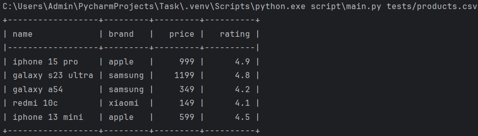
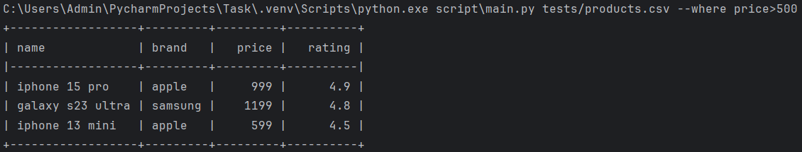
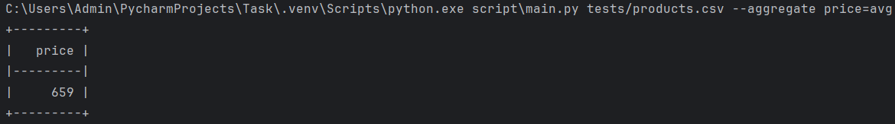
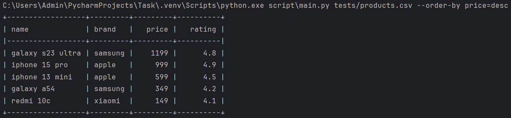
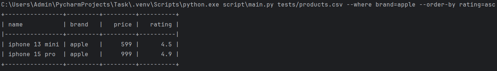

# Обработчик CSV-файлов

Скрипт для фильтрации, агрегации и сортировки данных в CSV-файлах. Поддерживает:
- Фильтрацию с операторами `>`, `<`, `>=`, `<=`, `=`.
- Агрегацию: `avg` (среднее), `min` (минимум), `max` (максимум).
- Сортировку: `asc` (по возрастанию), `desc` (по убыванию).

## Требования
- **Python 3.13.4** или новее
- Установленные зависимости:
```bash
  pip install colorama==0.4.6 iniconfig==2.1.0 packaging==25.0 pluggy==1.6.0 Pygments==2.19.2 pytest==8.4.1 tabulate==0.9.0
```

## Использование
```bash
python script/main.py <путь_к_файлу.csv> [--where "колонка=значение"] [--aggregate "колонка=функция"] [--order-by "колонка=порядок"]
```

### Примеры запуска
1. **Вывод всей таблицы**:
   ```bash
   python script/main.py tests/products.csv
   ```
**Результат:**


2. **Фильтрация (цена > 500)**:
   ```bash
   python script/main.py tests/products.csv --where "price>500"
   ```
**Результат:**


3. **Агрегация (средняя цена)**:
   ```bash
   python script/main.py tests/products.csv --aggregate "price=avg"
   ```
**Результат:**


4. **Сортировка (по убыванию цены)**:
   ```bash
   python script/main.py tests/products.csv --order-by "price=desc"
   ```
**Результат:**


5. **Комбинированный пример**:
   ```bash
   python script/main.py tests/products.csv --where "brand=apple" --order-by "rating=asc"
   ```
**Результат:**



## Тестирование
Запуск тестов:
```bash
pytest
```